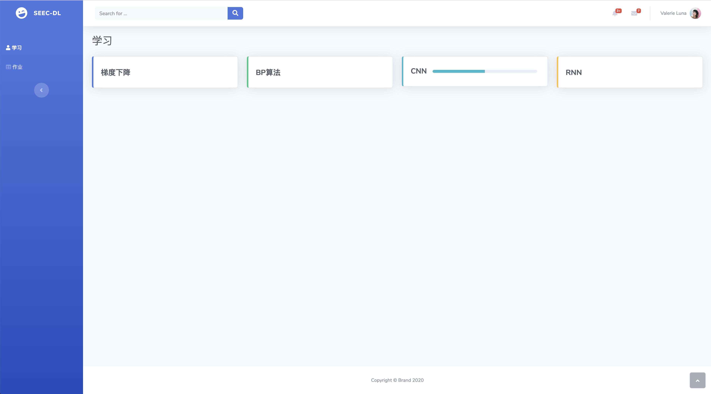
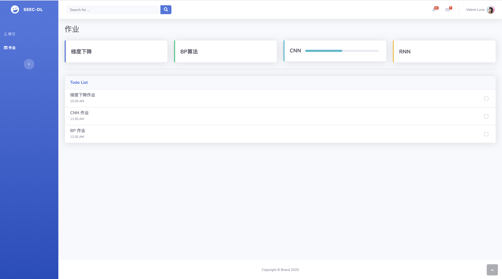

# 毕设需求

## 概述

### 学习子模块

#### 学习子模块功能图

#### 功能列表

| 功能               | 描述                                                         |
| ------------------ | ------------------------------------------------------------ |
| 教师管理教程       | 教师对教程进行增、删、查、改（教程以 Markdown 文档的格式进行管理） |
| 学生阅读教程       | 学生阅读教程内容进行学习                                     |
| 教师管理小练习     | 1.对练习进行增、删、查、改 2.查看学生完成情况（个人 + 整体统计） |
| 学生进行小练习     | 1.进行练习 2.查看结果和统计信息                           |
| 算法可视化         | 对算法过程进行可视化                                         |
| 神经网络模型可视化 | 对神经网络模型进行可视化，参考 [TensorFlow playground](http://playground.tensorflow.org/) |

## 功能描述

### 教师管理教程

- 教师对教程进行增、删、查、改（教程以 Markdown 文档的格式进行管理）。

#### 刺激/响应序列

- 刺激：用户选择查看已有教程
- 响应：系统显示已有教程文档列表
- 刺激：用户请求对教程列表排序和过滤
- 响应：系统显示排序后的教程列表
- 刺激：用户请求查看某文档具体内容
- 响应：系统显示该文档内容
- 刺激：用户输入关键字请求对文章按照文章名称进行搜索
- 响应：系统显示搜索结果
- 刺激：用户请求创建新的教程文档
- 响应：系统显示新建文档表格，要求用户填写文档相关信息
- 刺激：用户填写新建文档信息后请求提交
- 响应：系统显示新建文档提交结果
- 刺激：用户请求删除某文档
- 响应：系统显示删除结果
- 刺激：用户请求修改某文档信息
- 响应：系统显示修改文档信息表格，要求用户填写
- 刺激：用户填写完成修改文档信息表格请求提交
- 响应：系统显示修改文档结果

#### 相关功能需求

| 需求                                   | 描述                                                         |
| -------------------------------------- | ------------------------------------------------------------ |
| Readings.Teacher.Request.List          | 系统应该允许用户查看教程列表                                 |
| Readings.Teacher.Request.Content       | 系统应该允许用户查看某份教程的具体内容                       |
| Readings.Teacher.Request.Search        | 系统应该允许用户对某个教程进行搜索（按照教程的名称）         |
| Readings.Teacher.Request.SortAndFilter | 系统应该允许用户对教程列表进行排序和过滤（排序的域有：名称、时间、章节） |
| Readings.Teacher.New                   | 系统应该允许用户创建新的教程。用户需要提交的信息有：教程名称、教程的具体内容、教程所属章节 |
| Readings.Teacher.Delete                | 系统应该允许用户删除已有教程                                 |
| Readings.Teacher.Commit                | 系统能够记录教程的信息：教程名称、创建时间、最后一次改动时间、教程内容、提交人、最后一次改动的发起人 |
| Readigns.Teacher.Modify                | 系统应该允许用户对现有教程进行修改，能够修改的内容包括：教程名称、教程所属章节、教程的具体内容 |

### 学生阅读教程

#### 刺激/响应序列

- 刺激：用户请求查看已有教程
- 响应：系统显示现有教程列表
- 刺激：用户请求查看教程具体内容
- 响应：系统显示教程具体内容
- 刺激：用户请求对教程进行搜索、过滤或排序
- 响应：系统显示搜索、过滤或排序的结果

#### 相关功能需求

| 需求                           | 描述                                                         |
| ------------------------------ | ------------------------------------------------------------ |
| Readings.Student.List          | 系统应该允许用户查看教程列表                                 |
| Readings.Student.Search        | 系统应该允许用户对教程进行搜索（按照名称进行搜索）           |
| Readings.Student.SortAndFilter | 系统应该允许用户对教程列表进行排序和过滤（排序的域有：名称、时间、章节） |
| Readings.Student.Content       | 系统应该允许用户查看某份教程的具体内容                       |

### 教师管理小练习

- 对练习进行增、删、查、改
- 查看学生完成情况（个人 + 整体统计）

#### 刺激/响应序列

- 刺激：用户请求查看某练习题
- 响应：系统显示该练习题内容
- 刺激：用户请求创建新的练习题
- 响应：系统显示新建练习题表单，要求用户填写
- 刺激：用户完成填写新建练习题表单后请求提交
- 响应：系统显示新建练习题结果
- 刺激：用户请求修改练习题
- 响应：系统显示修改练习题表单要求用户填写
- 刺激：用户完成填写修改练习题表单后请求提交
- 响应：系统显示修改练习题结果
- 刺激：用户请求删除某练习
- 响应：系统显示删除结果
- 刺激：用户请求查看某练习的学生完成情况
- 响应：系统显示该练习学生完成情况列表
- 刺激：用户请求查看某学生在某练习上的具体完成情况
- 响应：系统显示该学生在该练习上的具体完成情况

#### 相关功能需求

| 功能                           | 描述                                                         |
| ------------------------------ | ------------------------------------------------------------ |
| Exercise.Teacher.Create        | 系统应该允许用户为某个教程创建新的练习题。创建练习时需要填写的信息包括：题目类型（主观、客观）、题目形式（单选、多选、填空）、题目描述、参考答案（客观题为必填，主观题为可选）、题目分数、允许提交次数 |
| Exercise.Teacher.Content       | 系统应该允许用户查看某一教程的所有练习题                     |
| Exercise.Teacher.Delete        | 系统应该允许用户删除某一教程的所有练习题（单个练习题的删除并入修改练习题的范围） |
| Exercise.Teacher.Modify        | 系统应该允许用户修改某一教程的练习题。能够修改的内容包括所有创建时需要填写的信息，以及能够删除某道练习题 |
| Exercise.Teacher.Record        | 系统应该记录用户修改或创建练习题的行为信息，包括：创建时间、修改时间、操作用户身份信息（ID） |
| Exercise.Teacher.Result.All    | 系统应该允许用户查看所有学生在某一练习上的完成情况。每个学生的完成情况包括：最后得分、学生身份信息（ID） |
| Exercise.Teacher.Result.Person | 系统应该允许用户查看某一学生在某练习上的具体完成情况。具体完成情况包括：每次练习的完成情况（参考 Exercise.Student.ShowResult）、学生身份信息（ID）、最后得分 |

### 学生进行小练习

- 进行练习
- 查看结果和统计信息

#### 刺激/响应序列

- 刺激：用户选择某章节练习并请求开始
- 响应：系统显示练习内容等待用户作答
- 刺激：用户完成练习后请求提交
- 响应：系统显示提交结果
- 刺激：用户请求查看某次练习完成情况
- 响应：系统显示此次练习中用户的完成情况
- 刺激：用户请求查看所有练习结果的统计信息
- 响应：系统显示所有练习完成情况的统计信息

#### 相关功能需求

| 功能                        | 描述                                                         |
| --------------------------- | ------------------------------------------------------------ |
| Exercise.Student.Do         | 系统应该允许用户进行练习并提交完成结果                       |
| Exercise.Student.ShowResult | 系统应该允许用户查看某次练习的完成情况。完成情况包括的信息有：总分数、每道题目得分、每道题目的参考答案以及用户的答案 |
| Exercise.Student.Statistics | 系统应该允许用户查看所有练习完成情况的统计信息。需要统计的信息有：已经完成的练习、尚未进行的练习、已完成练习的分数列表 |
| Exercise.Student.RecordAll  | 系统应该能够记录用户所有的答题情况（包括同一练习的多次作答）。答题情况和 Exercise.Student.ShowResult 中的完成情况一致 |

## 可视化设计

考虑的方面：

1. 展示的要点
2. 能够互动的内容

### 梯度下降

1. 体现要点
   - 下降方向选择梯度方向时下降速度最快
   - 不合适的步长所引发的“震荡”现象
   - 实现三维坐标系（可选）
   - 每一步的计算过程
   
2. 能够互动的内容
   
   - 用户能够在某一次的下降中选择下降方向，与下降方向不为梯度方向时的下降量进行对比
   
3. 布局设计

   

   - 函数图：图像化梯度下降过程
   - 流程图：展示计算梯度下降的步骤
   - 计算过程：展示每一轮的计算结果

## 用例列表

| 用例编号 | 用例名称         | 参与者 |
| -------- | ---------------- | ------ |
| 1        | 学习 AI 教程     | 学生   |
| 2        | 完成章节作业     | 学生   |
| 3        | 查看作业提交详情 | 学生   |
| 4        | 管理作业信息     | 教师   |
| 5        | 查看作业完成情况 | 教师   |

## 详细用例描述

### 用例1 学习 AI 教程

|     条目     | 内容                                                         |
| :----------: | :----------------------------------------------------------- |
|      ID      | 1                                                            |
|    创建者    | 廖均达                                                       |
|     时间     | 2020.2.28                                                    |
|     名称     | 学习 AI 教程                                                 |
|  最后更新者  | 廖均达                                                       |
| 最后更新日期 | 2020.2.28                                                    |
|    参与者    | 学生                                                         |
|   触发条件   | 用户需要学习系统提供的 AI 知识                               |
|   前置条件   | 用户已经经过学生身份验证                                     |
|   后置条件   | 无                                                           |
|    优先级    | 高                                                           |
|   正常流程   | 1. 用户选择进行学习 2. 系统显示章节列表 3. 用户选择某一章节进行查看 4. 系统显示该章节相关 AI 知识内容 |
|   扩展流程   | 4a. 如果该章节存在可视化小程序，用户可点击查看可视化程序 &emsp;1. 系统提示满意度选项不能为空，要求用户重新输入 4b. 用户选择进行该章节小练习 &emsp;1. 系统显示该章节练习题 &emsp;2. 用户完成练习并提交 &emsp;3. 系统显示练习结果，包括分数，每道练习题的评分，正确答案 |
|   特殊需求   | 无                                                           |

### 用例2 完成章节作业

|     条目     | 内容                                                         |
| :----------: | :----------------------------------------------------------- |
|      ID      | 2                                                            |
|    创建者    | 廖均达                                                       |
|     时间     | 2020.2.28                                                    |
|     名称     | 完成章节作业                                                 |
|  最后更新者  | 廖均达                                                       |
| 最后更新日期 | 2020.2.28                                                    |
|    参与者    | 学生                                                         |
|   触发条件   | 用户希望进行章节作业                                         |
|   前置条件   | 用户通过学生身份验证                                         |
|   后置条件   | 更新作业提交记录                                             |
|    优先级    | 高                                                           |
|   正常流程   | 1. 用户选择开始作业 2. 系统显示章节列表 3. 用户选择某一章节进行查看 4. 系统显示该章节作业列表 5. 用户选择列表中的某一作业 6. 系统显示作业内容，包括作业描述，评分标准 7. 用户完成作业并提交 8. 系统显示提交结果 |
|   扩展流程   | 7a. 用户通过 Git 提交作业 &emsp;1. 系统构建用户作业并显示结果 7b. 用户通过 Web IDE 提交作业 &emsp;1. 系统构建用户作业并显示结果 |
|   特殊需求   | 无                                                           |

### 用例3 查看作业提交详情

|     条目     | 内容                                                         |
| :----------: | :----------------------------------------------------------- |
|      ID      | 3                                                            |
|    创建者    | 廖均达                                                       |
|     时间     | 2020.2.28                                                    |
|     名称     | 查看作业提交详情                                             |
|  最后更新者  | 廖均达                                                       |
| 最后更新日期 | 2020.2.28                                                    |
|    参与者    | 学生                                                         |
|   触发条件   | 用户需要查看某次作业提交详情                                 |
|   前置条件   | 用户已经经过学生身份验证且该作业已经提交过至少一次           |
|   后置条件   | 无                                                           |
|    优先级    | 高                                                           |
|   正常流程   | 1. 用户进入某项作业选择查看提交情况 2. 系统显示改作业所有提交记录，一项提交记录包括：提交时间、评分 3. 用户选择某一提交记录进行查看 4. 系统显示该次提交详情 &emsp;4.1. 用户选择查看某测试用例结果 &emsp;4.2 系统显示该测试用例详情，包括：测试输入，期望输出与用户的实际输出 &emsp;4.3 用户选择查看此次提交的代码 &emsp;4.4 系统显示此次提交的代码 &emsp;4.5 用户选择修改代码 &emsp;4.6 系统将该次代码拷贝到该次作业的 WebIDE 中，作业提交流程参考用例 3 |
|   扩展流程   | 4a. 如果该次作业成功构建并存在可视化模型，用户可点击查看可视化模型 &emsp;1. 系统显示可视化模型  |
|   特殊需求   | 无                                                           |

### 用例4 管理作业信息

|     条目     | 内容                                                         |
| :----------: | :----------------------------------------------------------- |
|      ID      | 4                                                            |
|    创建者    | 廖均达                                                       |
|     时间     | 2020.2.28                                                    |
|     名称     | 管理作业信息                                                 |
|  最后更新者  | 廖均达                                                       |
| 最后更新日期 | 2020.2.28                                                    |
|    参与者    | 教师                                                         |
|   触发条件   | 用户需要发布、修改                                           |
|   前置条件   | 用户通过教师身份认证                                         |
|   后置条件   | 更新作业信息                                                 |
|    优先级    | 高                                                           |
|   正常流程   | 1. 用户发布作业 &emsp;1.1 用户选择发布作业 &emsp;1.2 系统显示作业信息表格等待用户填写，需要填写的信息包括：作业描述，评分标准，测试用例（或测试数据），截止时间 &emsp;1.3 用户填写表格并提交 &emsp;1.4 系统显示提交结果 2. 用户修改作业信息 &emsp;2.1 用户选择修改作业信息 &emsp;2.2 系统显示作业修改表格，可修改的信息与发布时需填写的信息一致 &emsp;2.3 用户提交修改 &emsp;2.4 系统显示提交结果 |
|   扩展流程   | 无                                                           |
|   特殊需求   | 无                                                           |

### 用例5 查看作业完成情况

|     条目     | 内容                                                         |
| :----------: | :----------------------------------------------------------- |
|      ID      |                                                              |
|    创建者    | 廖均达                                                       |
|     时间     | 2020.2.28                                                    |
|     名称     | 查看作业完成情况                                             |
|  最后更新者  | 廖均达                                                       |
| 最后更新日期 | 2020.2.28                                                    |
|    参与者    | 教师                                                         |
|   触发条件   | 用户需要查看某次作业学生的完成情况                           |
|   前置条件   | 用户通过教师身份认证                                         |
|   后置条件   | 无                                                           |
|    优先级    | 高                                                           |
|   正常流程   | 1. 用户选择查看作业完成情况 2. 系统显示作业列表 3. 用户选择某次作业进行查看 4. 系统显示该次作业描述以及作业提交情况总览，包括：1. 提交人数 2.已提交作业的学生的姓名、学号、最后得分、提交时间 5. 用户选择某个学生查看详细信息 6. 系统显示该学生作业完成情况的详细信息，包括：1. 所有提交记录 2.最高分提交记录的代码、测试正确率 7. 用户选择生成成绩报告 8. 系统生成成绩报告并发送给用户 |
|   扩展流程   | 6a. 用户选择查看历史提交记录中的某次提交详情 &emsp;1. 系统显示该次提交的详细信息，包括：代码，测试正确率 |
|   特殊需求   | 无                                                           |

## 界面原型图

### 学生

1. 学习系统主界面

   

2. 学习系统某一章节详情（包括教程文本、小练习和可视化程序）

   - 教程文本界面如下
   
     

3. 作业系统主界面

   

4. 某次作业界面（包括题目描述、提交记录和 WebIDE）

   - 提交记录界面如下

     

   5. 作业提交详情

      

### 教师

1. 发布作业

   

2. 查看作业完成情况

   - 某学生详细的完成情况参考界面4的提交记录界面和提交详情界面

   - 提交总览界面如下
   
     

