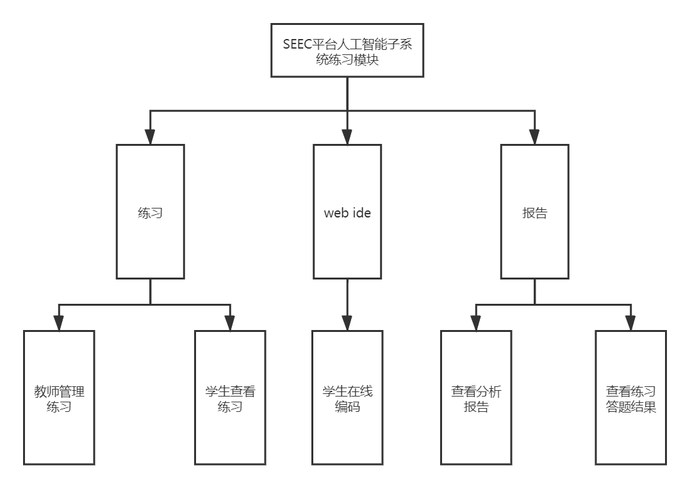

# 毕设需求

## 概述

### 学习子模块

#### 学习子模块功能图

#### 功能列表

| 功能               | 描述                                                         |
| ------------------ | ------------------------------------------------------------ |
| 教师管理教程       | 教师对教程进行增、删、查、改（教程以 Markdown 文档的格式进行管理） |
| 学生阅读教程       | 学生阅读教程内容进行学习                                     |
| 教师管理小练习     | 1.对练习进行增、删、查、改 2.查看学生完成情况（个人 + 整体统计） |
| 学生进行小练习     | 1.进行练习 2.查看结果和统计信息                           |
| 算法可视化         | 对算法过程进行可视化                                         |
| 神经网络模型可视化 | 对神经网络模型进行可视化，参考 [TensorFlow playground](http://playground.tensorflow.org/) |

注：

- “小练习”指每章教程后附属的通常形式为选择、填空的练习题，需要与练习模块中的练习（通常为编程作业）进行区分

### 作业子模块

#### 作业子模块功能图

#### 功能列表

| 功能             | 描述                                                         |
| ---------------- | ------------------------------------------------------------ |
| 学生查看练习     | 学生在登录系统后可以按照不同的人工智能子主题分类查看相应的练习 |
| 学生完成练习     | 学生可以使用web ide完成练习并进行提交或者是将练习clone到本地后完成并通过GitLab进行提交 |
| 教师管理练习     | 教师可以使用平台对练习进行增删改操作                         |
| 教师查看练习     | 教师可以使用平台查看练习的详情，包括练习的描述以及总体的学生完成情况。教师也可以进一步选择查看某个具体学生的练习完成情况 |
| 学生查看分析报告 | 学生可以在完成练习后使用平台查看针对某个知识单元、整体的分析报告。 |
| 教师查看分析报告 | 教师可以查看对某个知识单元、整体的全体学生分析报告或单个学生分析报告 |

